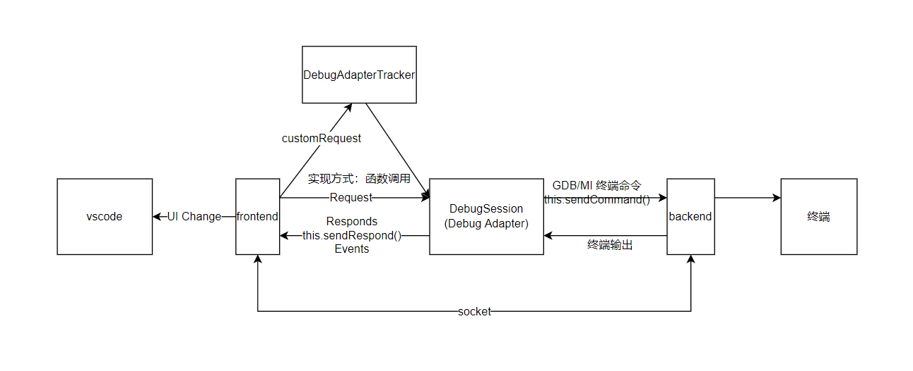
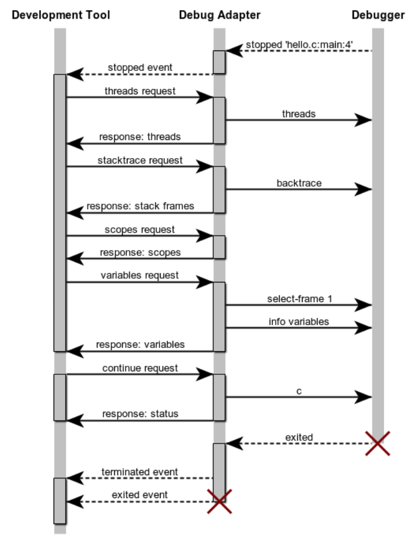
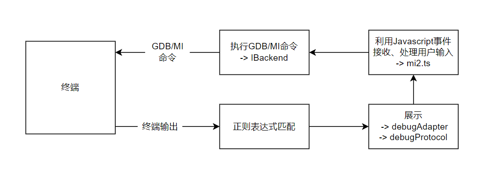
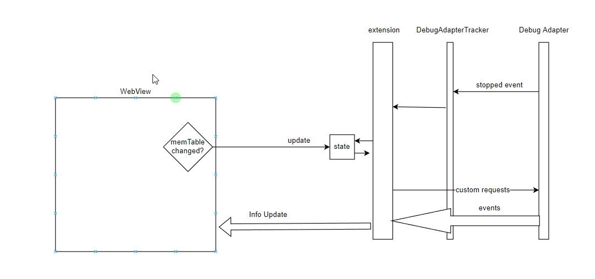

# proj158-rust-debugger

## 概述

### 项目背景及意义

方便的源代码级调试工具，对监测程序运行状态和理解程序的逻辑十分重要；高效的Rust语言跟踪能力，是Rust操作系统内核开发的必要工具，对基于Rust的操作系统教学和实验很有帮助。然而现有RISC-V、Rust实验环境搭建成本高，上手难度大，不利于学习与开发工作。本项目拟实现一种基于网页访问的在线实验系统，提供方便、高效的手段实现在QEMU和RISC-V开发板上的Rust教学操作系统的源代码调试。

### 项目的主要工作

1. 在VSCode编辑器的已有debugger插件基础上，扩展对Rust语言和操作系统内核特征的源代码级跟踪分析能力。主要包括：
    - 关键的寄存器和内存的数据获取；
    - 当前特树级信息的准确获取；
    - 函数调用栈跟踪；
    - 一个例子：在USM三态修改符号表，并获取内存单元信息；
    - 对被跟踪内核运行环境的适配：QEMU

2. 通过docker容器提供在线版本vscode、rust工具链以及qemu-system-riscv64等调试rCore-Tutorial-v3所需要的工具，使用户可通过网页远程调用云端qemu/RISC-V开发板的gdb调试器进行代码跟踪与调试。该部分已基本完成，见docker文件夹。待debugger插件功能稳定后上传docker hub。

## 安装

1. 获取risc-v工具链
在[sifive官网](https://www.sifive.com/software)下载risc-v工具链（往下拉找到GNU Embedded Toolchain — v2020.12.8, 下载ubuntu版本），
或者试试直接访问
[这里](https://static.dev.sifive.com/dev-tools/riscv64-unknown-elf-gcc-8.3.0-2020.04.1-x86_64-linux-ubuntu14.tar.gz)。下载后将该文件复制到home目录下。

1. 修改rCore-Tutorial-v3的源码和编译参数：[见此](./docs/rCore-mod.md)

1. 创建launch.json（可根据自己需要修改）: [见此](./docs/launchjson.md)

## 使用

1. 打开rCore-Tutorial-v3的目录
2. `ctrl+shift+p` ，执行命令`core-debugger.launchCoreDebugger`
3. 清除所有断点
4. 设置内核入口、出口断点
5. 按continue按钮开始运行rCore-Tutorial
6. 当运行到位于内核出口的断点时，插件会自动删除已有断点，此时用户可以设置用户态程序的断点
7. 在用户态程序中如果想观察内核内的执行流，应先清除所有断电，设置内核入口、出口断点
[视频演示](./docs/imgs/pre.mp4)

## Debugger插件设计

### 整体架构设计

### 子模块设计

#### GDB/MI Interface

GDB/MI是GDB面向机器的、基于行的文本接口。它用于支持将调试器作为Debugger插件的一个小模块来使用的系统开发。本项目通过`MIDebugger.sendCliCommand()`方法将用户请求（Debug Adapter Requests）转换为符合GDB/MI接口规范的文本并发送给GDB进程。

#### Debug Adapter

下图展示了Debugger插件的消息传递流程

该流程遵守Debug Adapter 协议。该协议主要规定了一下三类消息的结构和处理流程：

- Requests：各类消息请求的格式。本项目通过其中的CustomRequests扩展了一些操作系统调试相关的请求。
- Response：对于Requests的回应。
- Events：Debug Adapter事件。本项目新增的异步请求通过Events返回数据。

#### WebView

本项目通过VSCode提供的WebView类，创建一个网页提供用户交互界面。信息通过TypeScript事件传入网页，通过函数调用输出至Debugger插件。

#### Debug APIs

本项目调用了一些VSCode API实现部分常用流程的自动化，例如自动删除断点、切换调试信息文件等。

## 实现

编写代码时，我主要关注以下调试信息的处理流程：

### 关键的寄存器和内存的数据获取

### 断点检测

触发部分断点时，调试插件需要提特权级信息的更新。通过截获Debug Adapter触发的事件可以分析出当前触发的断点的行号和文件名。

### 调试信息的获取

rCore-Tutorial的用户程序默认没有`.debug_info`等DWARF段，修改链接脚本可以让链接器不忽略这些调试信息段。但这导致easy-fs的崩溃和栈溢出，故还需将easy-fs-fuse打包程序的磁盘大小，和栈空间改大。

### 获取特权级信息

risc-v处理器没有直接显示当前特权级的寄存器，故通过在代码中用户程序trap进入内核，和内核切换到用户程序二处设置断点，断点被出发时更新特权级信息。

### 界面美化

运用bootstrap等前端技术，提供对用户更加友好的图形界面：

## 开发记录和知识库

[在线版本(观看效果更佳)](https://shimo.im/docs/hRQk6dXkxHp9pR3T)

[离线版本](./docs/%E5%BC%80%E5%8F%91%E8%AE%B0%E5%BD%95%E5%92%8C%E7%9F%A5%E8%AF%86%E5%BA%93.pdf)
