# CoreDebugger-Docker

## 项目描述

本项目将实现一套适合操作系统开发的远程调试工具，主要由两部分组成：
- docker容器提供在线vscode、rust工具链以及`qemu-system-riscv64`等调试[rCore-Tutorial-v3](https://rcore-os.github.io/rCore-Tutorial-Book-v3/index.html)所需要的工具（已基本完成）
- 安装于在线vscode上的调试插件（基于Native Debug插件修改）。如下图所示，qemu在运行os时开启gdbserver，等待远程连接；vscode通过调试插件启动gdb，令其通过tcp协议连接gdbserver。



## 预期目标

- [ ] 展现内核数据结构
- [ ] 将gdb拿到的信息转换成符号
    - [ ] 支持函数调用的参数
- [ ] 系统调用跟踪
- [ ] 中断检测
- [ ] 进程切换跟踪
- [ ] 查看堆栈
- [ ] rust优化
    - [ ] 宏
- [ ] 高级功能
    - [ ] 文件存储
    - [ ] 花哨的图形界面
- [ ] 上传镜像到docker hub
- [ ] 支持uCore等其他项目
    - [ ] 符号表问题
- [ ] 支持实体开发板
- [ ] 文件存储功能
## 如何使用

### 构建docker容器

在[sifive官网](https://www.sifive.com/software)下载risc-v工具链（往下拉找到GNU Embedded Toolchain — v2020.12.8, 下载ubuntu版本），
或者试试直接访问
[这里](https://static.dev.sifive.com/dev-tools/riscv64-unknown-elf-gcc-8.3.0-2020.04.1-x86_64-linux-ubuntu14.tar.gz)。下载后将该文件复制到本项目的目录下。

构建容器：
```shell
docker build -t gdbgui-test . 
```
### 启动镜像
```dockerfile
docker run --cap-add=SYS_PTRACE --security-opt seccomp=unconfined -it --rm -v $PWD:/sharedFolder --name gdbgui-test-1 -p 3000:3000 -p 5000:5000  gdbgui-test 
```
启动后，终端会提示在线vscode的网页地址，一般是`localhost:3000`。

### 编译、运行、调试
1. vscode打开您的项目文件夹
1. (在vscode中)`cd ..`
1. 安装Native Debug和rust-analyzer（可选）插件
1. 创建`launch.json`:
    ```json
    "configurations": [
        {
            "type": "gdb",
            "request": "attach",
            "name": "Attach to qemu",
            "executable": "/home/workspace/rCore-Tutorial-v3/os/target/riscv64gc-unknown-none-elf/release/os",
            "target": ":1234",
            "remote": true,
            "cwd": "${workspaceRoot}",
            "valuesFormatting": "parseText",
            "gdbpath": "/home/workspace/riscv64-unknown-elf-toolchain-10.2.0-2020.12.8-x86_64-linux-ubuntu14/bin/riscv64-unknown-elf-gdb"
        },
    ]
    ```

1. 将`/home/workspace/Makefile`中的`PROJECT_NAME`变量和`launch.json`中的`rCore-Tutorial-v3`修改为欲调试项目的文件夹名。

1. （可选）使用[github镜像站](https://doc.fastgit.org/zh-cn/guide.html)：
    ```makefile
    make fast_github
    ```
1. 编译、运行：
    ```makefile
    make build
    make run
    ```
1. 点击▶按钮开始调试


