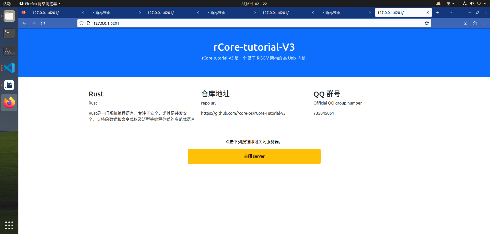

## 概述
接下来我们用我们的调试器调试 rCore-Tutorial 自带的 http 服务器，从中可以看出 GDB+eBPF 带来的方便。
## Bug 描述
`tcp-simplehttp` 是 rCore-Tutorial 自带的一个简单的 HTTP 服务器。服务器启动之后，在浏览器访问对应的 URL 即可获得服务器返回的静态页面。但是，如果我们在浏览器里打开多个标签页，每打开一个标签页，就在这个标签页里访问服务器的URL，就会发现一个奇怪的现象：一部分标签页成功显示出了网页，另一部分则一直在加载中，始终无法显示网页。而且，加载成功的标签页和加载失败的标签页是**交替出现**的。

作为对比，我们用同样的方式重复打开全国大学生计算机系统能力大赛的官网，结果是所有标签页都正常地打开了：

接下来，我们尝试在操作系统调试器的帮助下找到出错的原因并修复这个错误。

## 代码简述
在开始使用调试器之前，我们阅读了这个服务器的源代码，从而大致了解了它的工作流程：当服务器启动，进入到main函数后，main函数就会调用`listen()`库函数，在80端口开始监听。如果接收到客户端的连接，就调用handle_tcp_client 函数处理来自客户端的请求。handle_tcp_client 函数会先读取请求并检查是否为有效的 HTTP GET 请求，如果是的话，就从请求中提取出 URL ，并返回 URL 对应的 HTML 网页。此外，如果用户访问的是 `/close` 页面，服务器会在返回一个表示服务器关闭的网页后终止连接，并关闭服务器自身。

## Debug过程
首先，我怀疑服务器是否接收到了所有的 HTTP 请求。因此我们在服务器的 accept() 函数设置一个 eBPF 断点。这个 eBPF 断点会返回当前的所有寄存器值。从而获得`accept`函数的返回值和参数。

这样，这个bug就被修复了。在整个Debug的过程中我们不需要改动任何源代码。