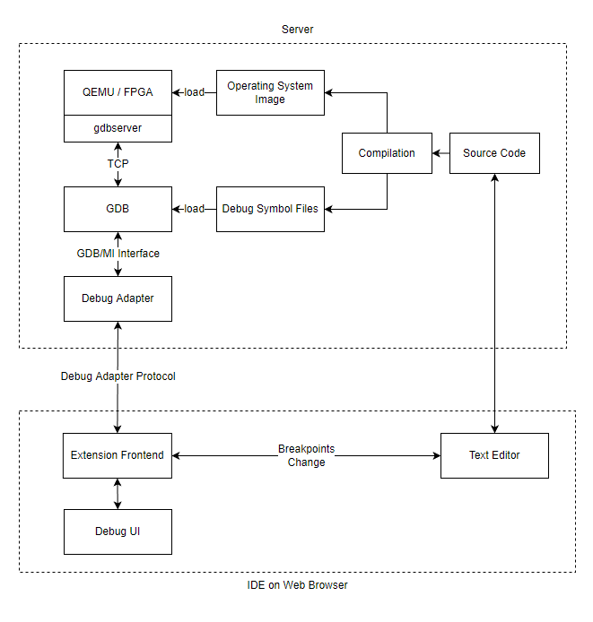

# proj158

支持 Rust 语言的源代码级内核调试工具

**指导老师**：吴竞邦 （北京工商大学）

**团队成员**：陈志扬 余叶 黄宗益 （北京工商大学）

---

## 起因

- rCore-Tutorial 实验
  - 环境配置繁琐
  - GDB TUI 不方便

---

## 在线调试系统

- 浏览器打开即用
  - 类似 github classroom
  - 提供在线 VSCode
- 调试者与被调试内核分离
- VSCode 插件支持操作系统相关的调试功能
  - 插件也可以在本地版本 VSCode 上使用

---

## 功能

- 寄存器
- 内存
- 断点
  - 支持在内核态设置用户态程序的断点
- 当前特权级
- 本地变量
- 自定义 GDB 语句
- 自动加载符号信息文件 

---

## 调试工具设计与实现

- 服务器
- 用户端
- 内核态用户态的断点冲突 

---

## 服务器

- 基于 `openvscode-server`提供网页版 vscode
- 提供 qemu、rust 工具链、gdb
- 自动编译、加载内核和 GDB 

---

## 符号信息的获取

- `Cargo.toml`编译参数
  - `debug=true`
  - `opt-level=0`
    - 修改 easy-fs-fuse
    - `USER_HEAP_SIZE`
    - ...
- `linker.ld` - 保留\*.debug 段 

---

## Debug Adapter

- 负责协调 VSCode 和 GDB 的独立进程。
- 消息类型
  - Request
  - Response
  - Event
- Debug Adapter Protocol - 大量 customRequest 

---

## 用户端

- Extension Frontend - 消息监听与转发 - Debug UI - WebView
  

---

## 内核态用户态的断点冲突

- GDB 限制：无法在内核态设置用户态代码的断点
  - 可能与页表刷新有关
- 解决思路：暂存断点，待时机合适再设置断点

---

## 断点组

- 在内核即将进入用户态，以及 trap_handler 处设置断点
- “进出口断点”被触发时清空断点，设置新断点
- 缓存暂时无法设置的断点，待时机合适再设置 
- 扩展：内存信息也可以如此“切换“

---

## 特权级切换处理

- 切换符号表文件
  - `add-file` -> GDB
- 切换断点组
- 更新当前所在特权级
  - risc-v 处理器无寄存器能显示反映当前特权级
  - 借助“边界”断点、地址空间、文件名判断

---

## 局限

- gdb 的 bug
  - Self 变量
  - Vec, VecDeque
    - 可查看但输出信息有误
- lazy_static!宏
- 被内联展开的函数

---

## 扩展

- 支持其他 OS
  - 获取符号表信息（例如 vmlinux）
  - 确定内核“出入口”断点
  - 修改当前特权级判断逻辑
  - 修改断点组判断逻辑
- 观察其他内核数据结构
  1. 添加`customRequest`，
     1. 收集数据：GDB 命令（mi2.ts）
     1. 返回信息：Events/Responses
  1. 插件进程解析 Events/Responses 并转发至 WebView（extension.ts）
  1. 添加 WebView 界面(extension.ts)

---

## todos

- 更多 os
- 更多内核数据结构
  - 如进程控制块
- WebView -> TreeView

---

## 项目仓库

https://github.com/chenzhiy2001/code-debug

---

## 谢谢！

---
