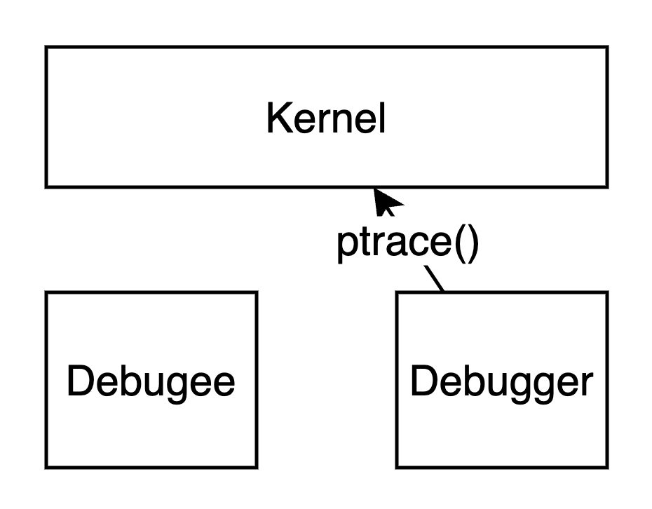
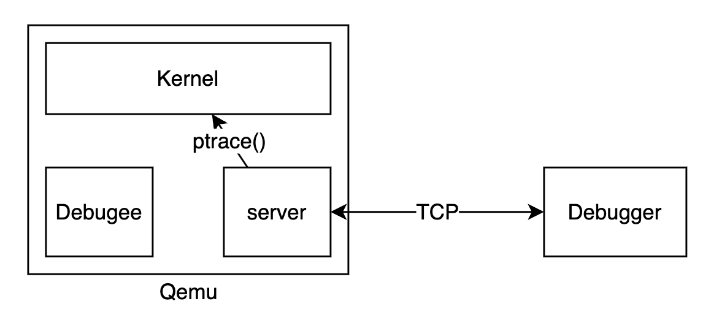
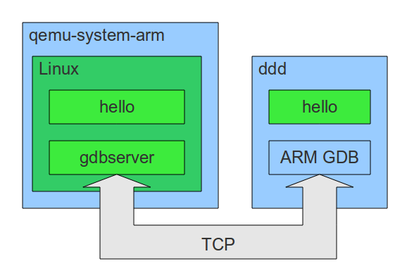
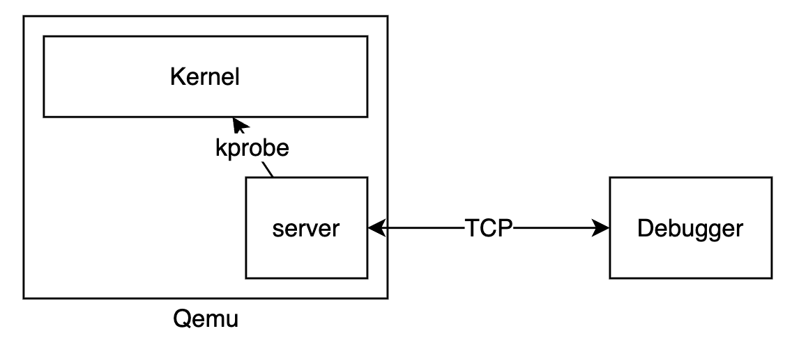
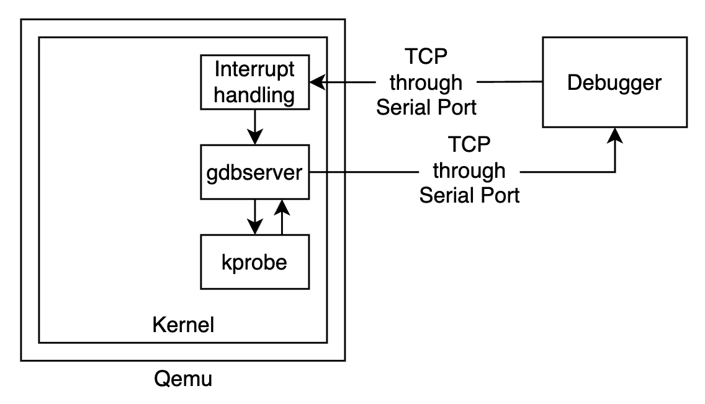
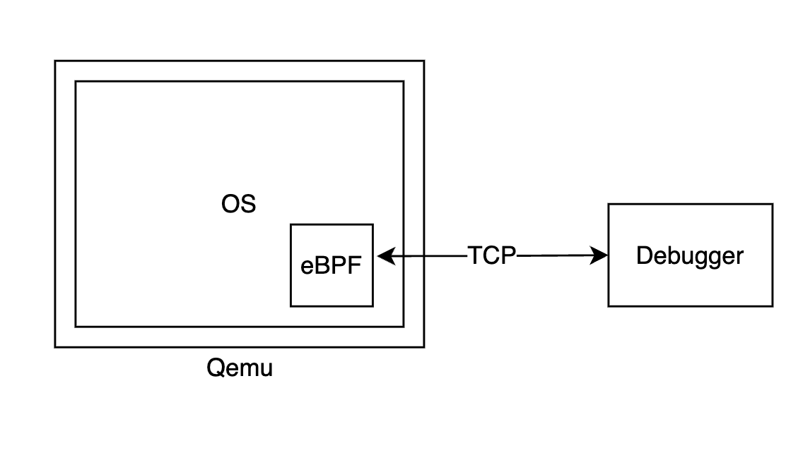

## 概述

调试普通的用户态程序时，我们一般这么做： gdb作为一个用户态程序，通过ptrace系统调用来控制同样处于用户态的被调试的程序（debugee）.

但是对于调试内核来说，这么做不太方便. 

一些嵌入式设备这样调试：将gdb分解为client和server，client通过TCP协议连接到用户态的gdbserver上. 

[这篇文章](https://balau82.wordpress.com/2010/08/17/debugging-arm-programs-inside-qemu/)就使用了这个方法：

我们可以采用类似的思路.

## 第一种方案

需要做的工作有：

1. 增加TCP/IP协议栈
2. 参考这个[简单的gdbserver的实现](https://github.com/bet4it/gdbserver/blob/master/gdbserver.c)实现gdbserver. 主要的工作是把里面的 `ptrace()`  改成kprobe相关的系统调用，以及编写配套的ebpf程序.
这个方案有两个缺点：

1. 需要增加网络协议栈，工作量较大
2. gdbserver是持续在用户态运行的，可能会干扰到调试. 
    1. gdbserver也可以持续在内核态运行（也就是一个内核task），但是也会干扰到调试
因此我想到一种更简单的方案，就是把gdbserver放在内核的中断处理流程里实现.这样做的优点有两个：

1. 不用增加网络协议栈
2. gdbserver不持续运行，减小对调试的干扰
## 第二种方案

工作流程大致是这样的：

1. gdb通过qemu的虚拟串口输入tcp报文。
2. 在qemu内的os里，串口输入产生中断。
3. os的中断处理模块将这些报文转发给内核态的gdbserver（只有此时它才运行，平时不运行）。
4. gdbserver在内核态利用kprobe设置断点，收集内存数据等，并通过串口返回tcp报文. 然后gdbserver就不运行了，直到下次串口有输入。
gdbserver的代码可以参考[probe-rs](https://github.com/probe-rs/probe-rs). 

这样的缺点是，需要对内核做大量改动。然而我们希望尽量减小调试工具和对某个具体内核的依赖。因此，考虑到eBPF的高隔离性，我们可以将gdbserver完全用ebpf来实现.

## 第三种方案

gdbserver完全用ebpf程序来实现。可能要额外加一些帮助函数（helper function）。

## 第四种方案

Debugger和eBPF模块通过SBI进行通信

## 第五种方案

我发现[probe-rs](https://github.com/probe-rs/probe-rs)除了提供gdbserver的支持，还提供了对[Debug Adapter](https://github.com/probe-rs/probe-rs#vscode)的支持. 因此，理论上我们可以去掉gdb和gdbserver这两个中间件，让插件和被调试的内核直接通信. 

