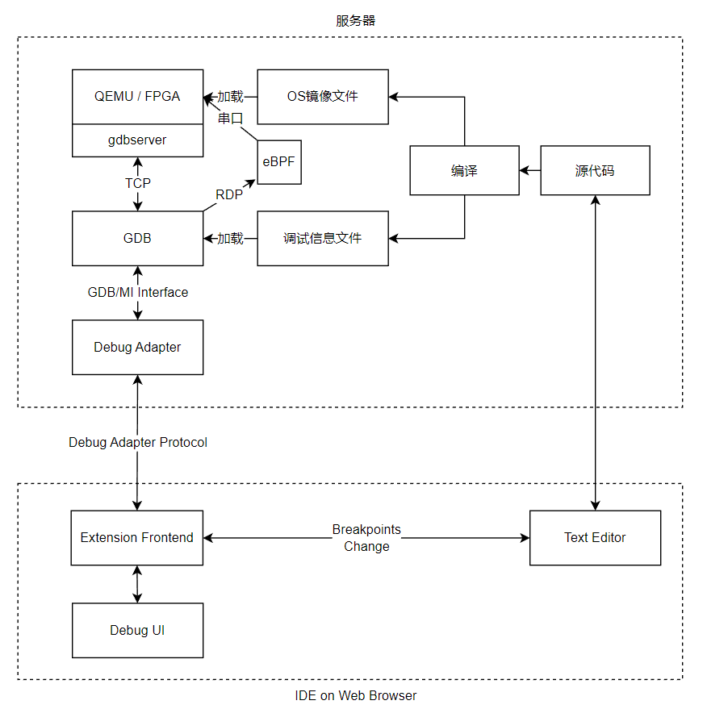
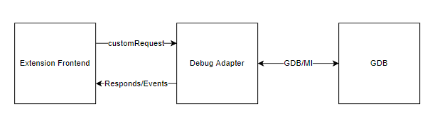

# 面向rCore-Tutorial操作系统的调试工具

## 摘要

方便的源代码级调试工具，对监测程序运行状态和理解程序的逻辑十分重要，尤其是相对复杂的内核代码以及用户
态、内核态的系统调用交互；高效的 Rust 语言跟踪能力，是 Rust 操作系统内核开发的必要工具，对基于 Rust
的操作系统教学和实验很有帮助。然而现有 RISC-V、Rust 实验环境搭建成本高，上手难度大，不利于初学者的内
核学习与开发工作。

我们实现了一种基于 VSCode 以及云服务器的内核源代码远程调试工具：在云服务器中部署 QEMU 虚拟机并运行
Rust 操作系统，通过操作系统的 eBPF 模块和 QEMU 提供 GDB 接口与用户本地的网页或安装版 VSCode 进行连接
，实现远程单步断点调试能力，提供一种对用户友好的 Rust 内核代码、用户态代码以及系统调用代码的调试方法
。

关键词：

## 第一章 引言

### 1.1 项目背景

rCore-Tutorial-v3 是一个基于 RISC-V 平台的、由 Rust 语言编写的类 Unix 教学操作系统。我们在做这个操作
系统的配套教学实验时发现，很多同学浪费了大量时间在安装 QEMU 虚拟机，Rust 工具链等环境上；配置好环境
之后，由于缺乏一个比较方便的调试手段，难以对操作系统的运行有深入的理解。

针对这两个问题，我们开发了一套在线调试系统。通过这套在线调试系统，用户不需要在自己的计算机上配置环境
，通过浏览器就可以编写、调试操作系统代码。这套在线调试系统同时配备了操作系统调试模块，具备和操作系统开发
密切相关的调试跟踪功能。

市面上的现有产品，例如 Github Codespaces[114514], 由于没有开放源代码，使用、部署的限制比较大。它可以
利用 Qemu 虚拟机的 gdbstub[]特性支持基于 gdb 的调试，但只能使用文本终端，翻阅代码很不方便，对于初学
者来说有较大学习成本。而且它不具备和操作系统开发密切相关的调试跟踪功能。

### 1.2 相关工作

#### 1.2.1 基于 Visual Studio Code 的在线调试方案

近年来，具有高度的可定制性的轻量级集成开发环境，如 Sublime Text、Atom 和 Visual Studio Code，已经迅
速普及。然而，轻量级 IDE 对操作系统在线调试的支持非常有限。在线调试的优势是,对本地计算机性能要求不高，无
需在本地配置开发环境，便于分享协作，可以构建高效的程序开发教学平台。

鉴于轻量级集成开发环境的日益普及，以及我们对操作系统在线调试支持的局限性的观察，我们基于
Visual Studio Code（最流行和最广泛使用的轻量级IDE之一）设计和实现了一个操作系统在线开发、调试环境。

## 第二章 调试工具设计与实现

### 2.1 整体架构设计

我们设计的在线调试系统通过调试者和被调试内核分离的设计来实现 Qemu 虚拟机或真实系统上的操作系统远程调
试。内核在服务器上运行，用户在浏览器里发送调试相关的请求，如下图所示。



图中 Source Code 是待编译的操作系统的源代码，当用户发出编译请求时，服务器中的 rust 工具链会通过特定
的编译参数编译操作系统源代码，产生满足操作系统调试要求的操作系统镜像和调试信息文件。如果用户接下来发
出调试请求，服务器中的 Qemu 或服务器连接的 FPGA 硬件就会加载操作系统镜像（本项目以 Qemu 为例），服务
器中的 GDB 会加载调试信息文件并连接至 Qemu 的 gdbserver。

图中 Extension Frontend 是运行在用户浏览器中负责操作系统调试相关功能的模块。Debug Adapter 是运行在服
务器中的独立进程，负责处理 Extension Frontend 发送来的请求。当 GDB 成功加载调试信息文件并连接至 Qemu
的 gdbserver 后，Debug Adapter 进程启动并开始接收 Extension Frontend 发送来的请求。Debug Adapter 会
将请求转换为 GDB 指令发送给 GDB。GDB 在执行完 GDB 指令后将 GDB/MI 格式的信息返回给 Debug
Adapter。Debug Adapter 解析后将结果返回给 Extension Frontend。

如果用户开启了 eBPF 跟踪功能，相关的eBPF模块会随着GDB的启动而激活，提供更加强大和灵活的动态跟踪调试功能。

Extension Frontend 收到 Debug Adapter 发送来的消息后，会将这些消息转换为界面更新消息，发送给 IDE on
Web Browser 上的调试界面（图中 Debug UI）和文本编辑器模块（图中 Text Editor）。同样，Debug UI 和
Text Editor 也可以向 Extension Frontend 发送消息，比如断点更新消息。

要完成以上的流程，服务器中需安装 openvscode-server、操作系统调试模块（以VSCode插件的形式提供）、Qemu，
包含GDB-python的risc-v工具链、rust 工具链。用户可以手动配置服务器中的安装这些软件，也可以使用我们配置好
的包含以上工具的 docker 容器，免去了配置的麻烦。

接下来我们分服务器和网页端两个部分介绍这套远程调试工具。

### 2.2 服务器部分

#### 2.2.1 在线 VSCode

OpenVSCode Server 是 VS Code 的一个分支，它在 VSCode 原有的五层架构的基础上增加了服务器层，使其可以
提供一个和 VSCode 功能相近的，通过浏览器即可访问的在线IDE。这个在线IDE可以和服务器上的开发环境、调试环
境通信。

用户可以在在线 IDE 上编辑项目源代码，同时可以远程连接到服务器上的终端。我们在服务器里配置好了 Qemu 虚拟
机和 GDB、Rust 工具链。用户可以自行通过终端命令使用 Qemu、GDB 等工具手动调试自己编写的操作系统，也可以
通过在线 IDE 中的操作系统调试模块进行更便利的调试。

如果用户选择用操作系统调试模块进行调试，操作系统调试模块做的第一步是编译内核并获取操作系统镜像文件
和调试信息文件。接下来我们以 rCore-Tutorial-v3[5]操作系统为例，阐述如何获取这两类文件。

#### 2.2.1 编译

在使用默认编译参数的情况下，rCore-Tutorial-v3 编译出的操作系统镜像和调试信息文件难以用于操作系统
调试。这是因为 rCore-Tutorial-v3 操作系统基于rust语言编写，使用rustc编译器。在默认情况下，
rustc编译器会对代码进行比较激进的优化，例如内连函数，删除大量有助于调试的符号信息。因此，我们
需要修改编译参数，以尽量避免编译器的优化操作。

rCore-Tutorial-v3 是用 cargo 工具创建的。一般而言，用 cargo 工具创建的 rust 项目可用
release, debug 两种模式编译、运行。在这两种模式中， release 模式对代码进行较高等级的优化，删除较多调试相关
的信息，而 debug 模式则对代码进行较弱等级的优化并保留了更多调试相关的信息，比较符合我们的需求。
但是由于 rCore-Tutorial-v3 项目本身的设计缺陷，这个项目不支持使用 debug 模式进行编译。因此，
我们需要修改 release 模式的配置文件，让编译器在 release 模式下也像在 debug 模式下一样关闭代码优化，
保留调试信息。

此外，rCore-Tutorial-v3 为了提升性能，修改了用户态程序的链接脚本，使得 .debug_info 等包含调试信息的
DWARF 段[114514]在链接时被忽略。这些段对调试用户态程序非常重要，因此我们需要修改链接脚本，移除这种忽略
。在修改了链接脚本后，为了让链接脚本生效，需要用 cargo clean 命令清空缓存。

在修改了编译参数、链接脚本后，编译出的可执行文件占用的磁盘空间显著增加，导致 rCore-Tutorial-v3 操作系统的
 easy-fs 文件系统无法正常运作，例如在加载文件时崩溃，栈溢出等。因此，我们调整了这个文件系统的
  easy-fs-fuse 磁盘打包程序的磁盘大小等参数。此外，由于可执行文件中保留了大量符号信息，用户程序在运行
时占用的内存也显著增加，因此需要调整操作系统的用户堆栈大小和内核堆栈大小。

我们将这些对于配置文件、链接脚本、操作系统源代码的修改整理成一个 diff 文件，用户只需要在远程终端中
通过 git 命令应用这个 diff 文件即可完成上述修改。我们同时也维护一个已经修改好的 rCore-Tutorial-v3
 Github 仓库供用户直接下载使用[]。

#### 2.2.3 Qemu 和 GDB

在编译完成后，服务器上的 Qemu 会加载操作系统镜像，并开启一个 gdbserver。接着，GDB 加载编译时生成的
符号信息文件并连接到 Qemu 提供的 gdbserver。如果用户开启了 eBPF 跟踪功能，Qemu中运行的操作系统会
启动基于 eBPF 的调试服务器（即 eBPF server）。这个基于 eBPF 的调试服务器会通过其专属的调试用串口连接到GDB上的 eBPF 调
试处理模块。

GDB 与 gdbserver、eBPF server 通过 GDB 远程串行协议 (RSP)[]进行通信。RSP 是一个通用的、高层级的协议，用于
将 GDB 连接到任何远程目标。 只要远程目标的体系结构（例如在本项目中是RISC-V）已经被 GDB 支持，并且远程目标
实现了支持 RSP 协议的服务器端，那么 GDB 就能够远程连接到该目标。

#### 2.2.4 Debug adapter

Debug Adapter 是一个独立的进程，负责协调在线 IDE 和 GDB。在 GDB 准备就绪后，Debug Adapter 进程会启动，
并开始监听在线 IDE 中 Extension Frontend 模块发送来的各种调试请求。

如下图所示，一旦 Debug Adapter 接收到一个请求，它就会将请求（Debug Adapter Requests）转换为符合 GDB/MI 接口规范
（GDB/MI 是一个基于行的面向机器的 GDB 文本接口，它专门用于支持将调试器用作大型系统的一个小组件的系
统的开发。[2]）的文本并发送给 GDB。GDB 在解析、执行完 Debug Adapter 发来的命令后，返回符合 GDB/MI 规范
的文本信息。Debug Adapter 将 GDB 返回的信息解析后，向 Extension Frontend 返回 Debug Adapter
Protocol 协议的 Respond 消息[]。此外，调试过程中发生的特权级切换、断点触发等事件会通过 Debug Adapter
Protocol 协议的 Event 消息发送给 Extension Frontend。



### 2.3 网页端部分

在用户浏览器上运行的在线 IDE 中，一个被称作 Extension Frontend 的模块负责和和服务器上的 Debug Adapter 通信。
它监听 Debug Adapter 的各种事件（如收到消息、发送消息）并做出反馈，如更新用户界面、根据用户请求发送 Requests、
响应 Responses 和 Events等。

#### debug UI WebView

### 2.4 内核态用户态的断点冲突

要实现操作系统调试功能的关键问题在于同时设置内核态、用户态的断点，但是用户态、内核态的断点设置是冲突
的。这是由于 GDB 根据内存地址设置断点，但是内核态切换到用户态时 TLB 会刷新。例如：rCore-Tutorial-v3
操作系统运行在内核态时，如果令 GDB 设置用户态程序的断点，这个用户态的断点不会被触发。原因是特权级切
换时执行了 risc-v 处理器的 sfence.vma 指令，使得 TLB 刷新成用户进程的页表，导致之前在内核地址空间设
置的断点失效。

解决这个问题的核心思路是，缓存设置后会造成异常情况的断点，待时机合适再令 GDB 设置这些断点。在用户态
运行时，缓存内核态断点；在内核态运行时，缓存用户态断点。为此，我们在 Debug Adapter 中新增了一个断点
组管理模块。

断点组管理模块用一个词典缓存了用户要求设置的（包括内核态和用户态）所有断点。词典中某个元素的键是内存
地址空间的代号，元素的值是这个代号对应的断点组，即这个内存地址空间里的所有断点。当任何一个断点被触发
时，Debug Adapter 都会检测当前触发的这个断点属于哪个断点组。我们将这些包含了最新触发断点的断点组称
为当前断点组（Current Breakpoint Group）。


当用户在 VSCode 编辑器中设置新断点时，Debug Adapter 会收到一个请求设置断点的 Request。Debug Adapter
中的断点组管理模块会先将这个断点的信息存储在对应的断点组中，然后判断这个断点所在的断点组是不是当前断
点组，如果是的话，就令 GDB 当即设置这个断点。反之，如果不是，那么这个断点暂时不会令 GDB 设置。

在这样的缓存机制下，GDB 不会同时设置内核态和用户态断点，因此避免了内核态用户态的断点冲突。接下来需要
一个机制，在合适的时机进行断点组的切换，保证某个断点在可能被触发之前就令 GDB 设置下去。显然，利用特
权级切换的时机是理想的选择。因此，我们令Debug Adapter 自动在内核态进入用户态以及用户态返回内核态处，
设置断点。我们称这两个断点为边界断点。如果边界断点被触发，就意味着特权级发生了切换，进而内存地址空间也会发生切换，因此断点
组也应当切换。我们令 Debug Adapter 每次断点被触发时都检测这个断点是否是边界断点。如果是的话，先移除
旧断点组中的所有断点，再设置新断点组的断点。如下图所示。


为了保证相关功能正常运作，断点组切换时，符号表文件也应随着断点组的切换而切换。

### 2.5 案例：当前特权级检测

调试操作系统与调试一般应用程序的一大区别是，调试操作系统时用户经常需要关注当前运行在什么特权级上。因
此，操作系统调试工具需要有检测当前特权级的功能。我们以特权级检测为例，展示这个操作系统调试工具的典型
处理流程。

当 Extension Frontend 监听到 GDB 触发断点、用户手动暂停、或 Debug Adapter 发送了 stopped Event 时
，Extension Frontend 发送一个 customRequest 请求 Debug Adapter 返回当前特权级、寄存器数据、内存数据
、断点列表等信息。

接着 Debug Adapter 响应这些请求，向 GDB 发送命令。RISC-V 处理器没有寄存器可以透露当前的特权级，因此
不能直接通过 info registers 这个 GDB 命令获得当前特权级。Debug Adapter 会尝试获取当前执行的代码的内
存地址和文件名，进而判断当前的特权级。

在得到当前所在的特权级后，Debug Adapter 向 Extension Frontend 返回 Responses。Extension Frontend 接
收并解析 Responses 和 Events，将信息传递到 Debug UI。Debug UI 收到信息后更新界面。

## 第三章 基于 eBPF 技术的跟踪调试

由于 GDB 对 Rust 语言的支持不如 C/C++ 语言完善，加上 GDB 静态跟踪的局限性，我们无法完整地获取到一些重要的内
核数据结构的信息。因此，我们编写了一个基于 eBPF 技术的 gdbserver（称为 eBPF server），它具有函数插桩等动态跟踪
功能，从而和 Qemu 虚拟机提供的 gdbserver 互补，获取到更多内核信息。

流程图

### 4.1 eBPF 技术简介

扩展伯克利包过滤器（extened Berkeley Packet Filter，简称 eBPF）是一个允许在内核里安全地执行不
受信任的用户定义插件的子系统。它依赖于静态分析来保护内核免受有漏洞的、恶意的插件的破坏。 eBPF 程序
可以满足各种复杂的监控需求。通过使用 kprobe，eBPF 程序能够在内核空间中动态地收集各种类型的信息，然后将这
些信息存储在 eBPF maps 中。

eBPF 程序具有隔离性，不干扰操作系统的运行状态。因此，用eBPF程序编写的 eBPF Server 只有强的动态跟踪能力
而没有控制被调试的操作系统的能力。控制功能只能通过 Qemu 虚拟机提供的 gdbserver 来实施。

### 4.2 eBPF server 的实现

我们的整体构想是，运用两种跟踪技术，即 gdbserver 和 eBPF server ，同时跟踪同一个目标（target），
即虚拟机中运行的rCore-Tutorial-v3 操作系统。我们把会改变操作系统状态的那个跟踪技
术（Qemu 的 gdbserver 或 OpenOCD ）称为 main-stub，eBPF 的 GDBServer 称为 side-stub。
Main-stub 具有可以改变操作系统运行状态的控制能力，而 side-stub 只负责收集信息，不影响内核的状态。
下表详细展示了 main-stub 和 side-stub 功能与局限。可以看出，二者形成了很好的互补：

|                      | 基于 eBPF 的 eBPF Server           | Qemu 的 gdbserver                                              |
| -------------------- | -------------------------------- | --------------------------------------------------------------------- |
| 读内存，读寄存器     | 可以                             | 可以                                                                  |
| 写内存，写寄存器     | 不可以                             | 可以                                                                  |
| 获取进程控制块等内核信息 | 方便   | 繁琐                                                  |
| 停下（halt）         | 不可以                             | 可以                                                                  |
| 单步                 | 不可以（因为不能停下）             | 可以                                                                  |
| watchpoint           | 不可以（因为不能停下）             | 可以                                                                  |
| 跟踪函数调用关系     | 优点：查看函数调用的参数         | 优点：查看函数调用栈                                                  |
| 断点                 | 类似tracepoint，触发后被调试的操作系统不能停下，主要起辅助作用     | 断点触发后被调试的操作系统会停下，这对于第二章所述的一些静态分析功能来说是必不可少的 |
| 跟踪异步函数         | 由于可以编写帮助函数，因此较方便 | 较繁琐                                                                |

利用 GDB 自带的远程调试功能和 Qemu 自带的 gdbstub 功能，我们很容易就能建立 main-stub 和 GDB 的连接。
接下来要解决的问题就是如何让 GDB 在连接到 main-stub 的同时也连接到 side-stub，即我们编写的 eBPF server。

GDB 和 main-stub 用 TCP 协议通信，但是由于主线版本的 rCore-Tutorial-v3 暂未提供稳定的网络协议栈和网卡驱动
支持（不论是真实网卡还是 Qemu 虚拟机的 virtio 虚拟设备）且 eBPF server 是运行在操作系统里的，因此若要让 eBPF
 server 用TCP协议连接到 GDB ，实现难度比较大。我们在调研了各种调试器与调试器服务器通信的方案后，选择用串口
进行二者的通信。

#### 4.2.1 基于串口的 GDB 与 eBPF server 的通信机制

由于 rCore-Tutorial-v3 的终端已经占用了一个串口用于文字输入输出，为了不影响操作系统的运行状态，eBPF Server 需要用另一个专属的
串口来和 GDB 通信。关于给虚拟机添加更多串口，大部分网上的资料仅提到添加一个 Qemu 启动参数，但是经过实际测试后发现这不起作用。原因是
Qemu 虚拟机并未支持 Risc-v 平台的多串口收发。因此，我们修改了 Qemu 虚拟机的源代码，为新串口分配了 MMIO 地址和 IRQ（中断号），还
修改了设备树初始化函数。我们发现运行在修改后的 Qemu 中的 rCore-Tutorial-v3 操作系统可以给第二个串口发送消息，但不能接收基于中断
机制的消息。这是因为在 RISC-V 中，存在用于保护物理地址的寄存器 pmpcfg 和 pmpaddr[引用risc-v文档]。而 rCore-Tutorial-v3
 的 SBI（rustsbi-qemu）通过设置这两个寄存器的值，使得只有 SBI 部分和 OS 所在的地址空间可以使用，而PLIC、串口等设备所在的物理地
址不可以使用。为了调试方便，我们修改了SBI对 pmpcfg 和 pmpaddr 的设置，使得所有物理地址都可以被使用。

同时，为了支持第二个串口的通信，我们参考原有的串口相关的代码，对 rCore-Tutorial-v3 做了尽可能少的修改，修改内容包括：添加第二个串口的初始化
例程、修改中断处理例程、添加用于在第二个串口收发单子节的系统调用和 eBPF 帮助函数（helper functions）。

至此，我们实现了基于中断的多串口数据收发，使得 GDB 与 eBPF server 可以通过串口通信。需要注意的是，eBPF 依赖的内核模块是不能通过 eBPF
 本身来调试的。比如，eBPF Server 依赖内核的串口，如果我们试图让 eBPF server 跟踪这个串口的行为，那么 eBPF Server 收集的数据也会通过
这个串口来发送，这又会触发 eBPF Server 的跟踪，进而陷入死循环。

#### 4.2.2 在 GDB 和 eBPF Server 之间实现 RSP 协议

在串口或网络之上，GDB 和 main-stub 之间用 RSP 高层协议进行通信。RSP协议规定的基本消息单位是由ASCII字符组成的数据包（packet），数据包的
格式如下所示：

`$packet-data#checksum`

其中，"$"用于标识数据包的开头，packet-data是传送的实际数据，checksum（即校验值）是"$"和"#"之间所有字符的模 256 和，它是八位无符号整数，
编码成ASCII字符后一定占用两个字符，所以"#checksum"这三个字符标示了一个数据包的结束。通信的双方在接收到数据包后，可以发送单个“+”字符表示
数据包接收成功，或发送"-"表示数据包接收失败，要求重发。

除此之外，还有一种通知数据包（Notification Packets）。它和普通的数据包的区别有两个：1）普通数据包的交流机制是同步的，而通知数据包是异
步的，常用于通知 GDB 某个事件的发生，2）收到通知数据包后无需像普通数据包一样发送"+"或"-"。

这套协议比较简明，且能满足我们的需求，因此，我们在GDB中增加一个子模块，这个子模块使用 RSP 协议和 side-stub 进行通信。考虑到这个子模块将会
有一个持续从串口接收字节流的线程，且有很多字符串处理流程，我们选择用 python 语言来编写这个模块，因为用 python 语言创建和管理线程比较简单，且已经
有功能强大的 pyserial 库能够便捷地处理串口消息的收发。

虽然 main-stub 和 side-stub 都使用 RSP 协议，但是在实际的通信上，main-stub 主要以同步的方式收发消息，这是因为Qemu 的 gdbserver 的调试机制
是同步的：Qemu 的 gdbserver 一般是在断点被触发，被调试的操作系统停下之后，才开始收集信息的。相比之下，side-stub 的跟踪调试功能主要依赖内核插桩
机制，在插桩触发之后 eBPF 程序收集数据，收集完毕后eBPF程序立即退出，操作系统继续运行。side-stub 不会，也不能为了和 GDB 通信而让操作系统停下。
（而且，操作系统的 eBPF 模块有 verifier 子模块 [] 专门用于确保这一点）。因此大部分的信息都会以异步的方式传送给GDB。这种异步的消息处理方式提供了
更高的并发性和响应性。然而，异步的消息可能会与同步的消息重合，这就要求和 side-stub 通信的 GDB 子模块具有较好的鲁棒性，能恰当地处理同步信息的字节流
被异步信息的字节流打断的情况。

如前文所述，RSP 协议规定，同步的消息以字符"#"开头，而异步的消息以字符"%"开头。利用这个特点，我们设计了一个消息处理流程,可以确保消息的有序处理：GDB中
负责和 side-stub 通信的子模块逐字节接收来自 side-stub 的消息，默认情况下按同步信息处理，如果发现接收到了字符“%”，则接下来接收到的字节都放入异步消
息处理例程，直到接收到"#"符号和后续的两个校验值后，再返回原来的同步消息处理流程继续从串口接收同步信息。这样，就算同步消息被异步消息打断，同步消息和异
步消息都能被完整地接收。

由于多个 eBPF 程序不会并发运行，因此异步消息流之间是按顺序发送的，不会互相重叠；运行 eBPF 程序时，操作系统其他部分是不运行的，操作系统中负责收发同步
消息的用户态进程也不运行，直到 eBPF 程序发送完了异步消息后，这个用户态进程才会继续运行，继续同步消息的发送，这种机制可以确保异步消息不会被同步消息打断。

图片（描绘同步消息流被异步的消息打断）

GDB 允许在不修改源代码的情况下支持 python 语言编写的扩展脚本，然而这个特性在我们使用的 Ubuntu20.04 的包管理器自带的GDB，和risc-v工具链
[https://github.com/riscv-collab/riscv-gnu-toolchain]提供的 GDB 可执行文件中都是关闭的，因此我们需要自行编译一份支持 python 扩展的GDB。

在 GDB 中运行的 python 脚本可以使用 gdb 库，通过继承这个库中的 MICommand 类，我们将这个和side-stub通信的子模块封装成一个 GDB/MI 命令
供 Debug Adapter 调用，这种封装也使得在在线 IDE 中适配 side-stub 变得容易（工作量相当于在已有代码的基础上支持一个新的 gdb 命令）。

一个典型的RSP如下图所示：
图片

#### 4.2.3 在 Debug Adapter 中适配 eBPF Server

至此，GDB可以同时连接到 gdbserver 和 eBPF Server. 在 GDB 的层面上，和 eBPF Server 的所有交互都是通过 side-stub 命令进行的。这个命令
的规范如下：

```
// 连接到ebpf server的串口.
// python脚本负责向串口发送信息.
// python脚本接收到的信息会返回给gdb.
-side-stub target remote /dev/tty1
```

```
// 在某地址设置断点，然后收集寄存器信息
-side-stub break 0x8020xxxx then-get register-info
```

```
// 收集函数参数
-side-stub arguments <function-name>
```

接下来要在 Debug Adapter 中适配 eBPF Server。从 Debug Adapter 的角度来说，适配的工作主要分两部分，第一个部分是修改
用于判断 GDB/MI 消息类别的正则表达式，使得 GDB 传来的 GDB/MI 消息能被正确地处理；第二个部分是，如果在线 IDE 请求执行一些
和 eBPF Server 有关的行为，需要将这些行为翻译成对应的 GDB/MI 消息并发送给 GDB。目前，我们已经适配了前两个命令。

#### 4.2.4 在在线 IDE 中适配 eBPF Server
 
与 Debug Adapter 类似，在线 IDE 对 eBPF Server 的适配工作也分两部分：第一个部分是添加和 eBPF Server 有关的用户界面
（包含 Debug UI 和 WebView）并将用户界面的相关事件绑定到 Debug Adapter Request 的发送函数上；第二个部分是将 Debug Adapter
 传来的 Events 和 Responses 信息进行解析并将这些信息更新到对应的用户界面元素上。

需要注意的是，在用户的使用流程上，gdbserver 和 eBPF Server 的区别在于，ebpf server 要提前指定好插桩触发后应执行的行为。二者的使用
流程具体如下：

gdbserver 的使用流程：

1. 用户在在线 IDE 中设置断点。
1. **断点触发，操作系统暂停运行**。
1. GDB 等待 Debug Adapter 传来的用户的指令，并据此执行信息收集，控制操作系统等行为。

eBPF Server 的流程：

1. 用户在在线 IDE 中设置断点并**提前指定断点触发后的操作**。
1. 操作系统中的 eBPF 模块注册相关的 ebpf 程序。
1. 断点触发，eBPF 程序执行这些操作，返回信息，os 继续运行。操作系统的状态和 eBPF 程序触发之前保持一致。

### 4.3 案例：系统调用跟踪及系统调用参数的获取

我们以系统调用跟踪及系统调用参数的获取为例，展示这套调试工具的使用流程。

首先，在rCore-Tutorial-v3中，每个系统调用都会被分发到对应的内核函数中进行处理。这些函数的参数都
根据Risc-V的函数调用规范（calling conventions）[]，若要获取系统调用的参数，只需要我们编写 eBPF 程序，获取到寄存器信息


，函数参数的收集方法


这是因为rcore的ebpf支持的缺陷程序rust格式的文本输出

### 第五章 总结与展望

### 5.1 总结

本项目的主要工作是在 VSCode 编辑器的已有的用于跟踪用户态程序的 debugger 插件基础上，扩展对 Rust 语言和操作系统内核
特征的源代码级跟踪分析能力。实现的功能主要包括：

1. 关键的寄存器和内存的数据获取；
2. 在内核态时设置用户态程序的断点；
3. 当前特权级信息的准确获取；
4. 自动更换符号表文件；

6. 一个例子：在 USM 三态修改符号表，并获取内存单元信息；
7. 对被跟踪内核运行环境的适配：QEMU

总的来说，这些技术的结合为我们提供了一种新的方式，以更高效、更灵活的方式进行系统调试和监控。尽管这些
技术各自具有一定的复杂性，但是它们的组合无疑将为我们在未来的系统设计和开发中提供巨大的可能性和潜力。

总的来说，通过结合使用 eBPF 技术、gdbserver 协议、Python 扩展和 QEMU 的新串口支持，我们可以构建一个
高效、灵活且功能强大的系统调试和监控平台。 eBPF 技术、gdbserver 协议、Python 扩展以及 QEMU 新串口的
支持，都在各自的领域中展示了出色的性能和灵活性。在这篇论文中，我们探索了如何将这些技术组合在一起，以
创建一个功能强大且高效的系统调试和监控平台。

通过 eBPF 技术，我们可以获取和存储大量的内核空间信息，从而更好地理解系统的运行状态。借助 gdbserver
协议和 Python 扩展，我们可以编写复杂的调试逻辑和处理程序，从而更好地控制和管理系统的运行。最后，通过
QEMU 新串口的支持，我们可以实现更高效的设备模拟，从而更好地满足系统的硬件需求。

### 5.2 展望

信息获取能力增强：uprobe、函数调用栈（参数和返 回值=>火焰图等信息展示）、异步函数调用栈；在真板子上获取信息；
断点和插桩自动选择

这种策略还可以应用 于多处理机、多线 程、多协程⋯

• 已完成工作
• 基于 Qemu 的 rust 内核在线调试工具
• 支持基于 GDB 的单步断点、内存查看、寄存器查看功能 • 内核态与用户态方便的切换跟踪
• 目前的进展与安排
• 支持基于 eBPF 的单步断点、内存查看、寄存器查看功能
• 函数调用动态跟踪
• 基于真实系统(FPGA 或 RISC-V 开发板)的远程实验与调
试系统

5. 函数调用栈跟踪；

函数调用动态跟踪、单步 断点、内存查看、寄存器查看、异步函数跟踪
## 参考文献

## 致谢
