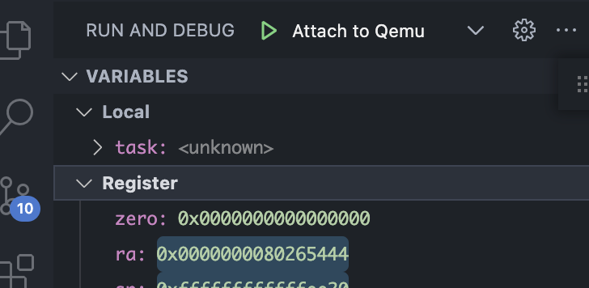

# 将 WebView 迁移到 TreeView

> Author: werifu
>
> Data: 2022.09.09

## 变动介绍

原本基于 WebView 的调试器架构如下：


要将数据展示给用户，需要创建一层 WebView 的视图，通过

1. 向 VSCode 发送信息
2. VSCode 向调试器（Debug Adapter，在 code-debug 里作为一个 DebugSession 存在）发送请求，即
   sendRequest
3. DA 向 gdb 发送命令，即 sendCommand
4. dgb 向 DA 返回 MI 格式的命令
5. DA 向 VSCode 发送响应，即 sendResponse
6. VSCode 向 WebView 发送消息
7. WebView 通过事件监听获得消息并渲染数据

这样的链路来实现信息的传递，这样做有比较高的自由度，但是忽略了 VSCode 本身就有 debugger 界面的支持，
因此最外层 WebView 与 VSCode 的交互会显得比较冗余，因此优化方案是使用 TreeView 来完全取代 WebView 的
功能，使其更像一个 debugger，提高用户体验。

修改后的架构如下


mibase 与更底层的架构没有变化，这里只是画得更精简。

## 数据展示（输出）

核心是我们砍掉了 WebView 与 VSCode 的交互，那我们如何展示数据？

VSCode 其实提供了几个重要的原生 request 接口，如 variablesRequest，其功能是展示 debugger 页中，左边
VARIABLES 中变量的名字与值。每当 VSCode 的代码调试发生了暂停，VSCode 都会自动发送一个
variablesRequest 向 DA 请求变量数据，那么我们只需要实现自定义的 variablesRequest，就可以做到自定义数
据，如下我们可以在 TreeView 里展示寄存器



## 命令发送（输入）

前面【数据展示】讲的是输出方面的，这节介绍输入的变动，WebView 的另一个功能是实现命令按钮，比如点一下
删除全部断点等等，如何直接做到 VSCode 里？

每个文件打开时右上角常常可以看到按钮，这些也是可自定义编辑的


点击按钮理应产生一个命令，我们往 package.json 的 contributes.commands 中注册命令，即可

```json
{
	"commands": [
		{
			"command": "code-debug.removeAllCliBreakpoints",
			"title": "Remove All Cli Breakpoints",
			"icon": {
				"dark": "images/remove-all-cli-breakpoints-dark.svg",
				"light": "images/remove-all-cli-breakpoints-light.svg"
			}
		}
	]
}
```

之后注册按钮，按钮在 package.json 的 contributes.menus 中注册，不同区域位于不同的 menu 中，其中右上
角所在的位置为 editor/title，当 group 为 navigation 时会显示在右上，否则折叠起来在最右上角的 `···`
中

```json
{
	"menus": [
		"editor/title": [
			{
				"when": "resourceLangId == rust",
				"command": "code-debug.removeAllCliBreakpoints",
				"group": "navigation"
			}
		]
	]
}
```

## 尚未完成

- 对于变量的数据展示

  - 现在都是使用 \<unknown\> 占位

- watchpoint 支持
- 通过代码为 VSCode 视图加断点
  - 研究了很多文档与问答，发现 VSCode 确实无法支持此功能，没有提供 API
